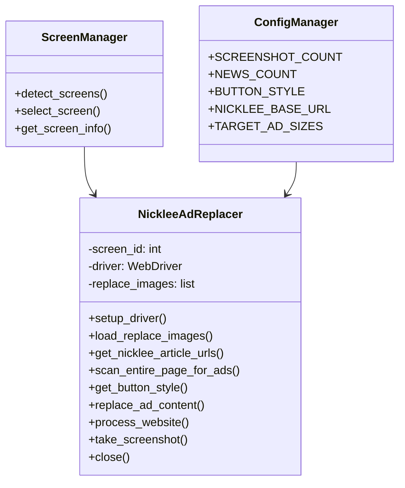
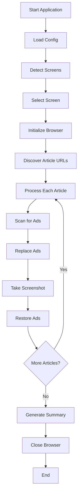

# Design Document

## Overview

The nicklee.tw ad replacer will be implemented as `nicklee_replace.py`, following the same architectural patterns as the existing ad_replacer.py. The system will inherit all core functionality including multi-screen support, ad detection algorithms, button styling systems, and configuration management while being specifically customized for the nicklee.tw website structure.

The design leverages the existing ScreenManager class and GoogleAdReplacer class architecture, with modifications to the URL discovery logic and website-specific selectors. All configuration will be managed through the existing config.py file with potential additions for nicklee.tw-specific parameters.

## Architecture

### Core Components



### System Flow



## Components and Interfaces

### 1. Configuration Integration

The system will extend the existing config.py with nicklee.tw-specific parameters:

```python
# nicklee.tw specific settings (to be added to config.py)
NICKLEE_BASE_URL = "https://nicklee.tw"
NICKLEE_TARGET_AD_SIZES = [
    {"width": 970, "height": 90},
    {"width": 728, "height": 90},
    {"width": 300, "height": 250},
    {"width": 320, "height": 50},
    {"width": 336, "height": 280}
]
```

### 2. URL Discovery Module

**Interface:**
```python
def get_nicklee_article_urls(self, base_url, count=20) -> List[str]
```

**Functionality:**
- Navigate to nicklee.tw homepage
- Discover article links using CSS selectors appropriate for the site structure
- Filter links to ensure they belong to nicklee.tw domain
- Return randomized selection of article URLs

**CSS Selectors Strategy:**
- Primary: `a[href*="/article/"]`, `a[href*="/post/"]`, `a[href*="/blog/"]`
- Secondary: Article container selectors based on common blog patterns
- Fallback: Generic link selectors with domain filtering

### 3. Ad Detection and Replacement Engine

**Core Methods:**
- `scan_entire_page_for_ads()` - Inherited from base class, no modifications needed
- `replace_ad_content()` - Inherited from base class, maintains all button styling logic
- `get_button_style()` - Inherited from base class, supports all 5 button modes

**Ad Size Detection:**
- Utilizes the same comprehensive scanning algorithm as the base system
- Checks all visible elements for matching dimensions
- Filters for ad-related elements using keyword detection
- Supports img tags, iframes, and background images

### 4. Screenshot and Restoration System

**Screenshot Naming Convention:**
```python
filepath = f"{SCREENSHOT_FOLDER}/nicklee_replaced_{timestamp}.png"
```

**Multi-Screen Support:**
- Inherits full ScreenManager functionality
- Supports macOS screencapture with -D parameter
- Windows MSS library integration
- Linux import command support
- Fallback to Selenium screenshots

**Ad Restoration Logic:**
- Preserves original src attributes using data-original-src
- Restores iframe visibility
- Removes injected button elements
- Maintains original ad positioning and styling

## Data Models

### Article URL Model
```python
{
    'url': str,           # Full article URL
    'title': str,         # Article title (optional)
    'discovered_at': datetime,  # When URL was found
    'processed': bool     # Processing status
}
```

### Ad Replacement Result Model
```python
{
    'element': WebElement,    # DOM element reference
    'original_dimensions': dict,  # {width: int, height: int}
    'replacement_image': str,     # Image filename used
    'button_style': str,          # Applied button style
    'screenshot_path': str,       # Generated screenshot path
    'restored': bool             # Restoration status
}
```

### Processing Summary Model
```python
{
    'total_articles': int,
    'successful_replacements': int,
    'screenshots_taken': int,
    'errors_encountered': list,
    'processing_time': float
}
```

## Error Handling

### Exception Hierarchy
- **NetworkError**: Connection issues, timeouts
- **ParsingError**: URL discovery failures, DOM parsing issues
- **ReplacementError**: Ad replacement failures
- **ScreenshotError**: Screenshot capture failures

### Error Recovery Strategies
1. **URL Discovery Failures**: Retry with alternative selectors, fallback to manual URL list
2. **Ad Replacement Failures**: Skip problematic elements, continue with remaining ads
3. **Screenshot Failures**: Attempt multiple screenshot methods, log failures but continue
4. **Browser Crashes**: Restart browser instance, resume from last successful article

### Logging Strategy
```python
# Progress logging
print(f"Processing article {i}/{total}: {url}")
print(f"Found {len(ads)} ads matching target dimensions")
print(f"Successfully replaced {count} ads")

# Error logging  
print(f"❌ Failed to process {url}: {error}")
print(f"⚠️ Screenshot failed, continuing with next article")

# Summary logging
print(f"✅ Completed: {total_screenshots} screenshots from {articles_processed} articles")
```

## Testing Strategy

### Unit Tests
- **ScreenManager**: Screen detection across different platforms
- **URL Discovery**: CSS selector effectiveness, domain filtering
- **Ad Detection**: Dimension matching accuracy, element filtering
- **Button Styling**: All 5 button modes, positioning accuracy
- **Configuration**: Parameter loading, fallback values

### Integration Tests
- **End-to-End Flow**: Complete article processing workflow
- **Multi-Screen**: Browser positioning and screenshot capture
- **Error Scenarios**: Network failures, malformed pages, missing elements
- **Performance**: Processing speed, memory usage, browser stability

### Manual Testing Scenarios
1. **Different Article Types**: Blog posts, news articles, product pages
2. **Various Ad Placements**: Header, sidebar, inline, footer ads
3. **Screen Configurations**: Single screen, dual screen, different resolutions
4. **Button Style Verification**: Visual confirmation of all button modes
5. **Restoration Accuracy**: Verify original ads are properly restored

### Test Data Requirements
- Sample nicklee.tw article URLs for testing
- Test replacement images in various dimensions
- Configuration files with different parameter combinations
- Mock network responses for error scenario testing

## Performance Considerations

### Optimization Strategies
- **Lazy Loading**: Load replacement images only when needed
- **Caching**: Cache discovered URLs to avoid repeated discovery
- **Parallel Processing**: Consider multi-threading for screenshot operations
- **Memory Management**: Properly dispose of WebDriver resources

### Scalability Factors
- **Article Volume**: Handle large numbers of discovered articles efficiently
- **Image Library**: Support extensive replacement image collections
- **Screenshot Storage**: Manage disk space for large screenshot volumes
- **Browser Resources**: Monitor and manage Chrome memory usage

## Security Considerations

### Data Protection
- No sensitive data storage or transmission
- Local file system access only for images and screenshots
- Browser automation within sandboxed environment

### Network Security
- HTTPS-only connections to nicklee.tw
- No external API calls or data transmission
- Local processing of all content

### File System Security
- Restricted access to designated folders only
- Validation of file paths and extensions
- Safe handling of user-provided configuration files